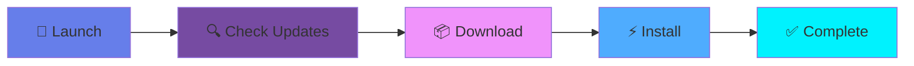
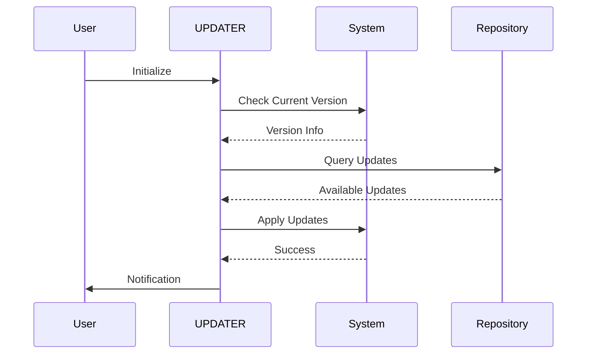
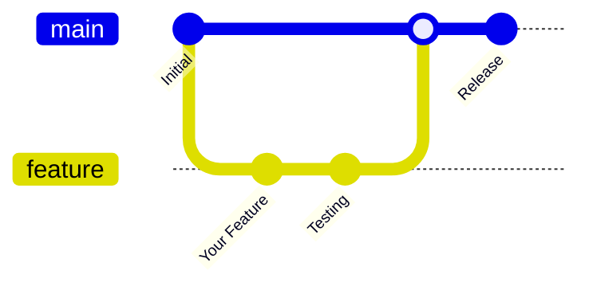

<div align="center">

```
██╗   ██╗██████╗ ██████╗  █████╗ ████████╗███████╗██████╗ 
██║   ██║██╔══██╗██╔══██╗██╔══██╗╚══██╔══╝██╔════╝██╔══██╗
██║   ██║██████╔╝██║  ██║███████║   ██║   █████╗  ██████╔╝
██║   ██║██╔═══╝ ██║  ██║██╔══██║   ██║   ██╔══╝  ██╔══██╗
╚██████╔╝██║     ██████╔╝██║  ██║   ██║   ███████╗██║  ██║
 ╚═════╝ ╚═╝     ╚═════╝ ╚═╝  ╚═╝   ╚═╝   ╚══════╝╚═╝  ╚═╝
```

<h3>⚡ Automated System Update Manager ⚡</h3>

[](https://github.com/BENNIE047/AUTO-UPDATE)
[](https://github.com/BENNIE047/AUTO-UPDATE/stargazers)
[](https://github.com/BENNIE047/AUTO-UPDATE/network/members)
[](LICENSE)
[](https://github.com/BENNIE047/AUTO-UPDATE)

<p align="center">
  
</p>

---

</div>

## 🌟 Overview

**UPDATER** is a powerful and intelligent automated system update manager designed to keep your system running smoothly with the latest updates. No more manual intervention—let UPDATER handle everything while you focus on what matters.

<div align="center">



</div>

## ✨ Features

<table>
<tr>
<td width="50%">

### 🎯 **Core Capabilities**
- ⚡ **Lightning Fast** - Optimized update process
- 🔄 **Automatic Scheduling** - Set it and forget it
- 🛡️ **Safe & Secure** - Verified update sources
- 📊 **Detailed Logging** - Track every change

</td>
<td width="50%">

### 🚀 **Advanced Features**
- 🎨 **Customizable** - Configure to your needs
- 🔔 **Smart Notifications** - Stay informed
- 🌐 **Cross-Platform** - Works everywhere
- 💾 **Backup Support** - Never lose data

</td>
</tr>
</table>

## 📦 Installation

<details open>
<summary><b>🐧 Linux / macOS</b></summary>

```bash
# Clone the repository
git clone https://github.com/BENNIE047/AUTO-UPDATE.git

# Navigate to directory
cd AUTO-UPDATE

# Make executable
chmod +x updater.sh

# Run UPDATER
./updater.sh
```

</details>

<details>
<summary><b>🪟 Windows</b></summary>

```powershell
# Clone the repository
git clone https://github.com/BENNIE047/AUTO-UPDATE.git

# Navigate to directory
cd AUTO-UPDATE

# Run UPDATER
.\updater.bat
```

</details>

## 🎮 Usage

### Quick Start

```bash
# Basic usage
./updater.sh

# With custom options
./updater.sh --schedule daily --notify

# Check status
./updater.sh --status
```

### ⚙️ Configuration

Create a `config.yml` file to customize UPDATER:

```yaml
schedule:
  frequency: daily
  time: "02:00"

notifications:
  enabled: true
  method: email

backup:
  enabled: true
  location: /var/backups

logging:
  level: info
  path: /var/log/updater
```

## 📊 How It Works

<div align="center">



</div>

## 🎨 Screenshots

<div align="center">

| Main Interface | Update Process | Completion |
|:--------------:|:--------------:|:----------:|
|  |  |  |

</div>

## 🤝 Contributing

We welcome contributions! Here's how you can help:

<div align="center">



</div>

1. 🍴 Fork the repository
2. 🌱 Create your feature branch (`git checkout -b feature/AmazingFeature`)
3. ✍️ Commit your changes (`git commit -m 'Add some AmazingFeature'`)
4. 📤 Push to the branch (`git push origin feature/AmazingFeature`)
5. 🎉 Open a Pull Request

## 📈 Stats

<div align="center">


</div>

## 🏆 Roadmap

- [x] Basic auto-update functionality
- [x] Scheduling system
- [x] Notification system
- [ ] Web dashboard interface
- [ ] Docker support
- [ ] Multi-language support
- [ ] Advanced rollback features
- [ ] Integration with CI/CD pipelines

## 📝 License

This project is licensed under the MIT License - see the [LICENSE](LICENSE) file for details.

## 💬 Support

<div align="center">

Need help? Reach out!

[](https://github.com/BENNIE047/AUTO-UPDATE/issues)
[](https://github.com/BENNIE047/AUTO-UPDATE/discussions)

</div>

## 🌟 Show Your Support

If you find **UPDATER** helpful, please consider giving it a ⭐ on GitHub!

<div align="center">

[](https://star-history.com/#BENNIE047/AUTO-UPDATE&Date)

</div>

---

<div align="center">

**Built with 💙 by [BENNIE047](https://github.com/BENNIE047)**


</div>
